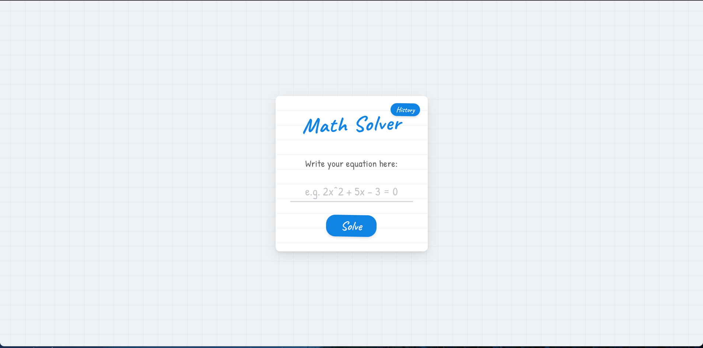

# Math Solver

A chalkboard-themed web app that solves mathematical equations step-by-step :)

## Features

- **Equation Solving**: Supports linear, quadratic, and other algebraic equations.
- **Step-by-Step Solutions**: Displays the full solving process so you can follow along.
- **Equation History**: Keeps a log of previously solved equations for easy reference.
- **Notes**: Attach personal notes to saved equations.

Visit it here: https://hendrashad-dev.github.io/math-solver/